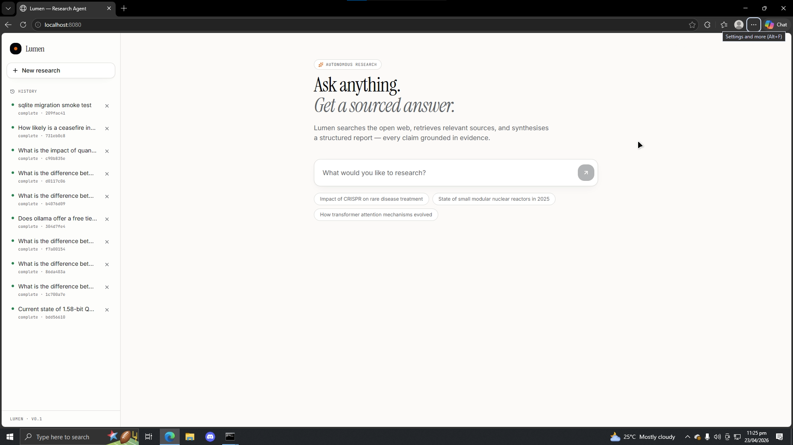
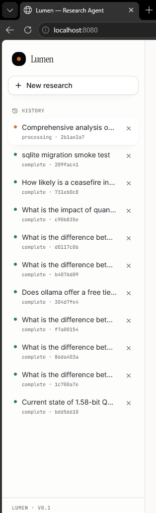
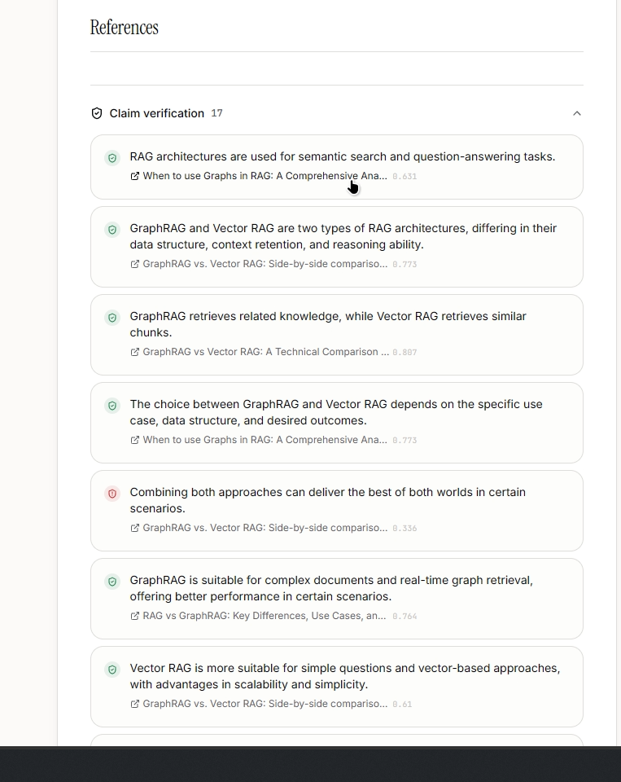
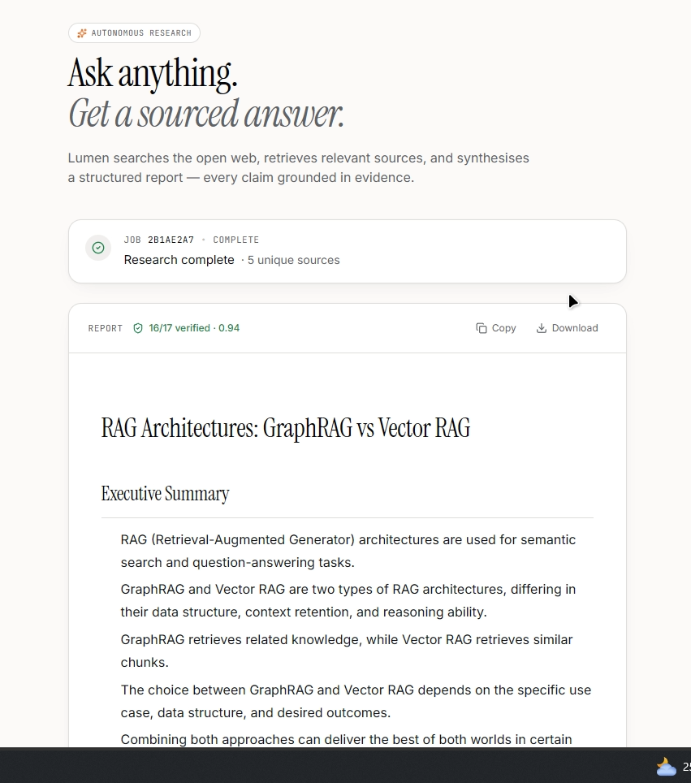
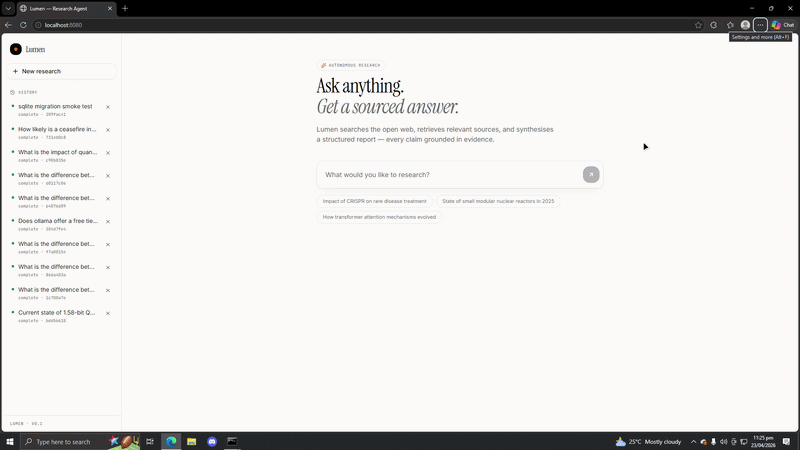
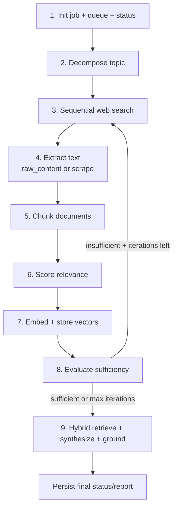

# Lumen Research Agent

Lumen turns open-web research into a reliable, auditable workflow: ask a question and get a structured, source-grounded report in minutes instead of hours. It is built for real-world reliability, with async orchestration, hybrid retrieval, streaming synthesis, and layered safeguards against provider throttling. The result is a fast research assistant that stays responsive even under API pressure.

Lumen is an asynchronous research web app that:

- accepts a user topic,
- decomposes it into sub-questions,
- searches the web and extracts text,
- scores and indexes evidence,
- retrieves with a hybrid lexical + semantic strategy,
- synthesizes a grounded report with live streaming, and
- exposes progress, history, and deletion through a React frontend.

This document explains the architecture, backend control flow, async design, fallback/retry behavior, and rate-limit protections in detail.

## Screenshots

Here are some screenshots of the Lumen Research Agent app:






## Demo



## Prerequisites / Quickstart

### Prerequisites

- Python 3.10+ with backend dependencies installed
- Node.js 18+ with npm
- Required API keys in `.env`:
  - `GROQ_API_KEY`
  - `TAVILY_API_KEY`
- Optional:
  - `GEMINI_API_KEY` (used for fallback on specific Groq rate-limit paths)
  - `REDIS_URL` (Redis is optional; app runs with SQLite-only persistence)

Copy and fill the template:

```bash
cp .env.example .env
```

### Quickstart

1) Start backend:

```bash
uvicorn backend.main:app --reload --port 8000
```

2) Start frontend:

```bash
cd frontend
npm install
npm run dev
```

3) Open:

- `http://localhost:8080`

## Tech Stack

### Backend

- `FastAPI` for HTTP API and background job orchestration
- `asyncio` for non-blocking pipeline stages and controlled concurrency
- `httpx` for outbound async HTTP calls
- `FAISS` + `sentence-transformers` for vector retrieval
- `rank-bm25` for lexical retrieval
- `SQLite` for durable job persistence
- Optional `Redis` for status caching

### Frontend

- React 19 + TanStack Router/Start (Vite-based)
- Tailwind CSS + UI components
- Streaming report reader via Fetch `ReadableStream`

## High-Level Architecture

1. Frontend starts a job with `POST /research`.
2. Backend immediately returns `job_id` and schedules a background task.
3. Frontend:
   - polls `/status/{job_id}` for step and timing updates,
   - consumes `/stream/report/{job_id}` for live synthesis tokens.
4. Backend pipeline runs async stages:
   - planning/decomposition,
   - sequential search,
   - bounded parallel extraction,
   - chunking and relevance scoring,
   - batched vector insertion,
   - sufficiency evaluation loop,
   - hybrid retrieval + synthesis + grounding.
5. Job metadata and final report are persisted in SQLite and listed in `/jobs`.

## Repository Layout

- `backend/main.py`: API surface and stream endpoint
- `backend/agent.py`: main async research loop
- `backend/services.py`: SQLite/Redis status + queues + in-memory corpus
- `backend/searcher.py`: Tavily search orchestration (rate-limit friendly)
- `backend/scraper.py`: async extraction fallback
- `backend/chunker.py`: sentence-aware chunking with overlap
- `backend/scorer.py`: LLM relevance scoring of chunks
- `backend/vecstore.py`: FAISS index and vector search
- `backend/hybrid_retrieval.py`: BM25 + FAISS fusion (RRF)
- `backend/synthesizer.py`: prompting, true streaming, fallback generation
- `backend/retry.py`: async retry/backoff utility
- `frontend/src/routes/index.tsx`: primary app page and stream consumer
- `frontend/src/components/*`: input/progress/report/history UI

## API Endpoints

- `POST /research`
  - input: `{ "topic": "..." }`
  - output: `{ "job_id": "...", "status": "processing" }`
  - schedules async background execution

- `GET /status/{job_id}`
  - returns structured job state:
    - `status`, `step`, `iteration`, `timings`, `report`, `grounding`, etc.

- `GET /stream/report/{job_id}`
  - streams report text chunks while synthesis is running
  - replays full report immediately for already-completed jobs

- `GET /jobs`
  - returns history list from SQLite (`job_id`, `topic`, timestamps, status)

- `GET /debug/synthesis/{job_id}`
  - returns retrieval/synthesis debug snapshot for troubleshooting quality
  - includes retrieved chunk snippets, chunks actually used in prompt, and selected provider/model

- `DELETE /jobs/{job_id}`
  - removes job from SQLite + optional Redis + in-memory stores

- `GET /health`
  - health probe

## Backend Logic: Step-by-Step

The orchestrator is `run_research_loop()` in `backend/agent.py`.

### 1) Job initialization

- A report queue is created per job (`asyncio.Queue`) for streaming output.
- Status is persisted as `processing` with step `starting/decomposing`.
- Timings dict starts empty and is incrementally updated.

### 2) Topic decomposition

- `decompose_topic()` asks the LLM for 3-5 focused search questions.
- If decomposition fails, pipeline falls back to `[original_topic]`.

### 3) Search stage (rate-limit aware)

- `search_queries_sequential()` runs queries one by one (not `gather`).
- A delay (`TAVILY_SEARCH_DELAY`) is inserted between queries.
- Results are URL-deduplicated.
- This controlled pattern lowers burst pressure on search APIs.

### 4) Extraction stage

- For each result:
  - prefer Tavily `raw_content` if available,
  - else scrape URL directly with `httpx` + BeautifulSoup.
- `extract_parallel()` uses `asyncio.Semaphore` to cap concurrent fetches.
- This balances throughput while avoiding outbound spikes.

### 5) Chunking stage

- `chunk_text()` in `backend/chunker.py`:
  - sentence-aware split,
  - hard caps oversized sentence units,
  - target chunk length with overlap,
  - discards very short chunks.
- Overlap preserves context continuity for retrieval/synthesis.

### 6) Relevance scoring stage

- Chunks are scored in small batches (`SCORE_BATCH_SIZE`).
- Between batches, random delay is added (`SCORE_BATCH_DELAY_MIN/MAX`).
- Only chunks above `RELEVANCE_THRESHOLD` are retained.
- If LLM scoring fails for a batch, that batch gracefully degrades to score `0.0`.

### 7) Embedding + vector indexing

- Filtered chunks are inserted into FAISS in batches (`VECTORIZATION_BATCH_SIZE`).
- Insert is run in `asyncio.to_thread(...)` to keep event loop responsive.
- Metadata includes `job_id` and `chunk_index` for scoped retrieval.
- Parallel in-memory lexical corpus is updated for BM25.

### 8) Sufficiency loop

- Hybrid retrieval pulls top evidence snippets.
- LLM judges if evidence is sufficient (`sufficient: true/false`) and identifies gaps.
- If insufficient:
  - follow-up sub-questions are generated,
  - loop continues until sufficient or max iterations reached.

### 9) Synthesis + grounding

- Hybrid retrieval produces synthesis context.
- Prompt enforces strict grounding and structured output.
- True token streaming from Groq feeds queue in real time.
- Grounding step extracts claims and verifies via embedding similarity.
- Final job status is persisted as `complete` with report + grounding.

### Pipeline flow diagram



## How the Frontend Was Built

The app is a single main route (`frontend/src/routes/index.tsx`) with focused components:

- `TopicInput`: starts jobs
- `Progress`: polls status and shows active step/iteration
- `Report`: renders markdown + grounding metadata
- `JobSidebar`: lists history and supports permanent deletion with confirmation

### Frontend control flow

1. User submits topic -> `POST /research`.
2. Route stores `jobId`, initializes optimistic status, enables polling.
3. A stream fetch is opened to `/stream/report/{jobId}`.
4. Bytes from `ReadableStream` are decoded incrementally and appended to UI text.
5. Polling `GET /status/{jobId}` drives pipeline state display.
6. On completion, stream stops and final report/grounding remains available from status.

### API wiring

- Vite dev server proxies `/research`, `/status`, `/jobs`, `/stream`, `/health` to backend.
- Optional `VITE_API_URL` can override the base API host.

## Async Model (Why Everything Stays Responsive)

The backend is intentionally async-first:

- FastAPI endpoints are async and non-blocking.
- Long work runs in background tasks, so request/response stays fast.
- Outbound network calls (search/scrape/LLM) use `httpx.AsyncClient`.
- Concurrency is bounded with semaphores and staged loops.
- CPU/blocking operations are isolated via `asyncio.to_thread`.
- Report streaming uses async queues and `StreamingResponse`.

The frontend is also stream-aware:

- incremental report rendering from response chunks,
- separate status polling channel for deterministic state updates.

## Complete Fallback Logic

Fallbacks exist at multiple layers so jobs complete even under partial failures.

### Search fallback

- Missing Tavily key -> empty results (no crash).
- Tavily errors -> retried via `async_retry`.
- Persistent failure -> logs + continue pipeline.

### Extraction fallback

- Prefer provider `raw_content` first.
- If absent -> direct scrape.
- Individual scrape failures return empty string, not fatal.

### Scoring fallback

- Batch-level LLM scoring failures are caught.
- Failed batch yields zero-scored chunks and pipeline continues.

### Synthesis fallback

- Primary path: true token streaming from Groq.
- If streaming fails:
  - fallback to non-stream synthesis path.
- Non-stream synthesis uses `generate_with_fallback(...)`:
  - primary Groq,
  - fallback to Gemini only on explicit rate-limit signals (`RATE_LIMIT`).

### Status/persistence fallback

- Optional Redis:
  - used when available for status acceleration.
- Durable source of truth:
  - SQLite row per job.
- If Redis read misses/fails, status is read from SQLite.

## Hybrid Retrieval Explained

`backend/hybrid_retrieval.py` combines:

- **Dense retrieval** from FAISS (semantic similarity),
- **Lexical retrieval** from BM25 (exact token matching),
- **Reciprocal Rank Fusion (RRF)** to merge both ranked lists.

Why this is better than vector-only:

- Dense retrieval captures semantic intent/synonyms.
- BM25 preserves exact keywords/entities/identifiers.
- RRF is robust to scoring-scale differences and improves ranking stability.

Result: better recall and better evidence diversity for synthesis/grounding.

## Retry and Anti-429 Strategy

The project uses layered controls to reduce and survive rate limits:

### 1) Request pacing and fan-out limits

- Sequential query execution for Tavily
- Inter-query delays
- Bounded scrape concurrency
- Groq semaphore to cap concurrent model calls

### 2) Smaller payloads and bounded batch sizes

- chunk caps/truncation
- limited chunk counts for scoring/synthesis
- vector insertion batching
- score batching + random jitter delay

### 3) Explicit backoff retry

`async_retry()` differentiates:

- 429/rate-limit signals -> longer backoff schedule
- other transient failures -> shorter backoff schedule

This prevents immediate hammering of upstream providers.

### 4) Multi-model fallback on rate-limit conditions

- Synthesis attempts Groq first.
- If rate-limited in fallback path, route to Gemini.
- Preserves end-user continuity during provider pressure.

### 5) Fault-tolerant stage boundaries

- Most stages catch errors locally, log them, and continue where safe.
- Job-level catastrophic failures still return a terminal `error` state cleanly.

## Persistence Model

Current durable persistence is SQLite (`data/lumen.db`):

- table: `jobs`
- stores full status lifecycle and final report fields
- history listing sorted by `updated_at`
- one-time migration imports legacy JSON records if DB is empty

Transient/in-memory per-job structures:

- `JOB_CORPUS` and `JOB_CHUNK_META` for lexical/hybrid retrieval
- `report_stream_queues` for live token streaming

## Environment Variables

See `.env.example` for the full list. The most important non-obvious knobs are:

- `MAX_ITERATIONS`: maximum retrieval/evaluation loops before synthesis
- `TAVILY_SEARCH_DELAY`: delay between sequential Tavily calls (reduces search API burst rate)
- `SCRAPE_CONCURRENCY`: cap on parallel extraction fetches
- `SCORE_BATCH_DELAY_MIN` / `SCORE_BATCH_DELAY_MAX`: jitter delay between relevance-scoring batches
- `VECTORIZATION_BATCH_SIZE`: number of chunks embedded per insertion batch
- `DB_PATH`: optional SQLite location (default `data/lumen.db`)
- `GROUNDING_THRESHOLD`: cosine-similarity threshold for claim verification
- `SYNTHESIS_PROVIDER`: `groq` (default) or `gemini`
- `GROQ_MODEL`: overrides Groq synthesis model (default `llama-3.3-70b-versatile`)
- `GEMINI_MODEL`: overrides Gemini model (default `gemini-1.5-flash`; can be `gemini-2.5-flash`)
- `MAX_SYNTHESIS_CHUNKS`: cap prompt chunks used by synthesis (default `8`)

## Local Development

### 1) Backend

```bash
uvicorn backend.main:app --reload --port 8000
```

If port 8000 is occupied on Windows, use another port:

```bash
uvicorn backend.main:app --reload --port 8001
```

### 2) Frontend

```bash
cd frontend
npm install
npm run dev
```

Frontend default local URL is `http://localhost:8080`.

## Operational Notes

- The global `httpx` client in `groq_client.py` is reused for efficiency.
- Redis is optional; SQLite remains the durable system of record.
- Deleting a job removes:
  - SQLite row,
  - Redis hash (if present),
  - in-memory corpus and stream queue entries.

## Why this design avoids rate-limit failures in practice

Lumen does not rely on a single mechanism; it combines:

- controlled concurrency,
- explicit pacing,
- retries with differentiated backoff,
- fallback models for synthesis,
- smaller/targeted contexts,
- robust stage-level exception handling.

This layered strategy is what keeps the app responsive and resilient under real-world API throttling and transient failures.
